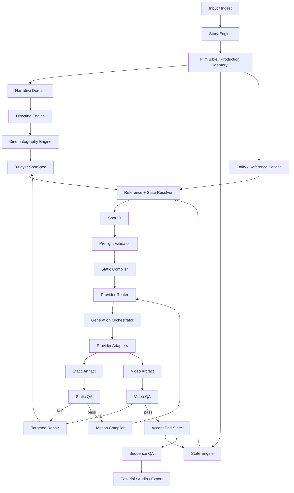

# COMPONENT_GRAPH.md

```mermaid
flowchart TD
    A[Input / Ingest] --> B[Story Engine]
    B --> C[Film Bible / Production Memory]
    C --> D[Narrative Domain]
    D --> E[Directing Engine]
    E --> F[Cinematography Engine]
    F --> G[8-Layer ShotSpec]
    C --> H[State Engine]
    C --> I[Entity / Reference Service]
    H --> J[Reference + State Resolver]
    I --> J
    G --> J
    J --> K[Shot IR]
    K --> L[Preflight Validator]
    L --> M[Static Compiler]
    M --> N[Provider Router]
    N --> O[Generation Orchestrator]
    O --> P[Provider Adapters]
    P --> Q[Static Artifact]
    Q --> R[Static QA]
    R -->|fail| S[Targeted Repair]
    S --> G
    R -->|pass| T[Motion Compiler]
    T --> N
    P --> U[Video Artifact]
    U --> V[Video QA]
    V -->|fail| S
    V -->|pass| W[Accept End State]
    W --> H
    W --> X[Sequence QA]
    X --> Y[Editorial / Audio / Export]
```
